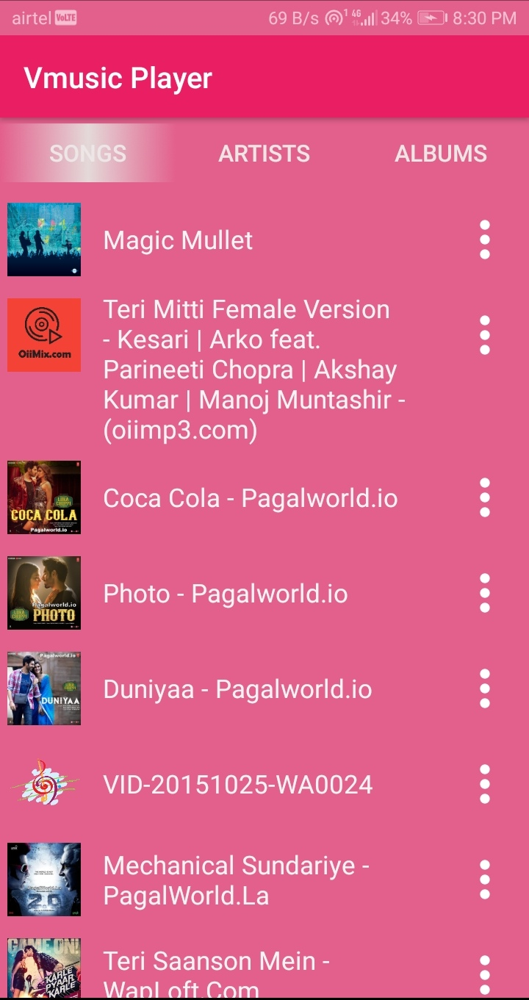

# Vmusic-Player
Vmusic Player is a simple music player app developed during my android learning sessions.It has feature of Repeat and Shuffle with animating background in Song Player Activity.

# Motive
Main motive for developing this App is to learn the basics of Android. As I mentioned above this Project ius developed during my android learning session. As a beginner the app must have bugs and errors.So anyone intrested can contribute as it is Open Source.

# ScreenShots

   
  

